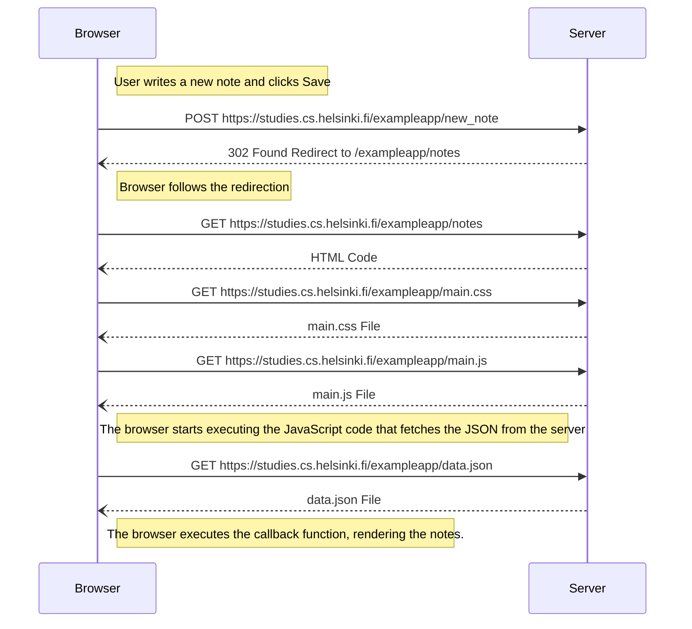

```mermaid
sequenceDiagram
  participant Browser
  participant Server
  Note right of Browser: User writes a new note and clicks Save

  Browser->>Server: POST https://studies.cs.helsinki.fi/exampleapp/new_note
  Server--)Browser: 302 Found Redirect to /exampleapp/notes
  Note right of Browser: Browser follows the redirection
  Browser->>Server: GET https://studies.cs.helsinki.fi/exampleapp/notes
  Server--)Browser: HTML Code
  Browser->>Server: GET https://studies.cs.helsinki.fi/exampleapp/main.css
  Server--)Browser: main.css File
  Browser->>Server: GET https://studies.cs.helsinki.fi/exampleapp/main.js
  Server--)Browser: main.js File
  Note right of Browser: The browser starts executing the JavaScript code that fetches the JSON from the server
  Browser->>Server: GET https://studies.cs.helsinki.fi/exampleapp/data.json
  Server--)Browser: data.json File
  Note right of Browser: The browser executes the callback function, rendering the notes.
```
