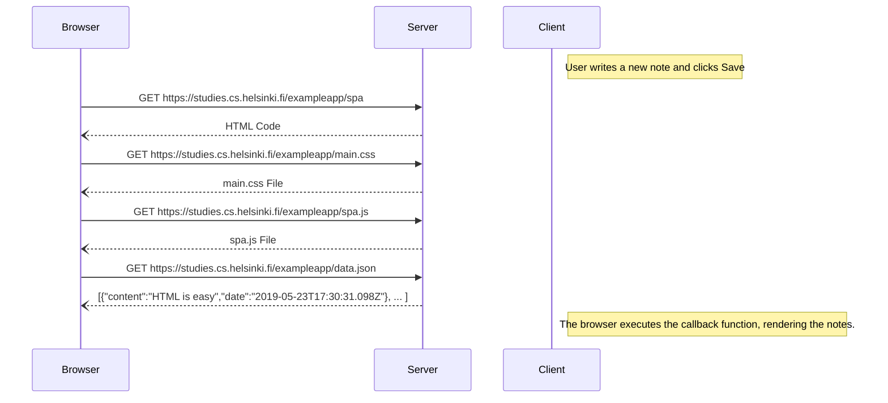

```mermaid
sequenceDiagram
  participant Browser
  participant Server
  Note right of Client: User writes a new note and clicks Save

  Browser->>Server: GET https://studies.cs.helsinki.fi/exampleapp/spa
  Server--)Browser: HTML Code
  Browser->>Server: GET https://studies.cs.helsinki.fi/exampleapp/main.css
  Server--)Browser: main.css File
  Browser->>Server: GET https://studies.cs.helsinki.fi/exampleapp/spa.js
  Server--)Browser: spa.js File
  Browser->>Server: GET https://studies.cs.helsinki.fi/exampleapp/data.json
  Server--)Browser: [{"content":"HTML is easy","date":"2019-05-23T17:30:31.098Z"}, ... ]
  Note right of Client: The browser executes the callback function, rendering the notes.
```
