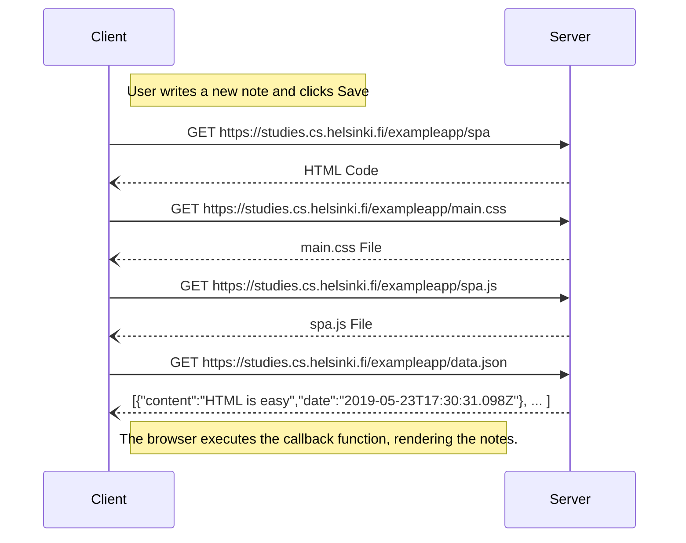

```mermaid
sequenceDiagram
  participant Client
  participant Server
  Note right of Client: User writes a new note and clicks Save

  Client->>Server: GET https://studies.cs.helsinki.fi/exampleapp/spa
  Server--)Client: HTML Code
  Client->>Server: GET https://studies.cs.helsinki.fi/exampleapp/main.css
  Server--)Client: main.css File
  Client->>Server: GET https://studies.cs.helsinki.fi/exampleapp/spa.js
  Server--)Client: spa.js File
  Client->>Server: GET https://studies.cs.helsinki.fi/exampleapp/data.json
  Server--)Client: [{"content":"HTML is easy","date":"2019-05-23T17:30:31.098Z"}, ... ]
  Note right of Client: The browser executes the callback function, rendering the notes.
```