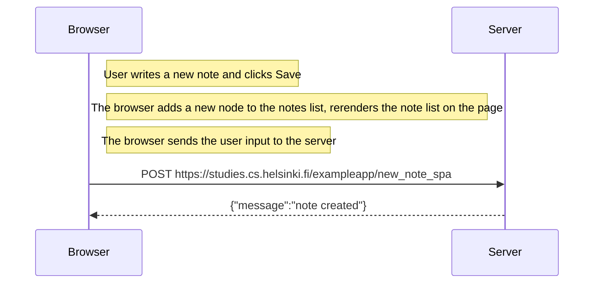

```mermaid
sequenceDiagram
  participant Browser
  participant Server
  Note right of Browser: User writes a new note and clicks Save

  note right of Browser: The browser adds a new node to the notes list, rerenders the note list on the page
    
     note right of Browser: The browser sends the user input to the server
    
    Browser->>Server: POST https://studies.cs.helsinki.fi/exampleapp/new_note_spa
    Server-->>Browser: {"message":"note created"}
```